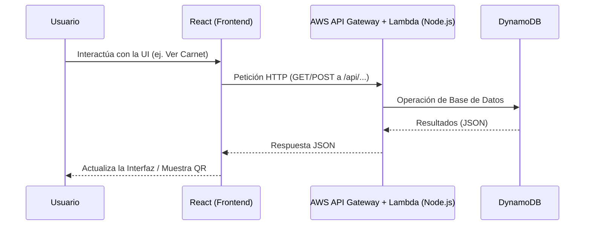

# Identera Frontend

Este es el frontend oficial del proyecto **Identera**, una aplicación web construida con **React** y **Vite**, encargada de la interfaz de usuario, gestión de perfiles, administración de iterantes y generación/escaneo de carnets (códigos QR).

## Arquitectura y Flujo de Datos



## Tecnologías Principales

- **React 19**: Biblioteca principal para la construcción de interfaces de usuario.
- **Vite**: Herramienta de construcción y servidor de desarrollo ultrarrápido con Hot Module Replacement (HMR).
- **React Router DOM**: Manejo de rutas y navegación de la Single Page Application (SPA).
- **Librerías QR y multimedia**: 
  - `qrcode.react`: Para la generación visual de códigos QR del carnet.
  - `html5-qrcode` y `jsqr`: Para escanear, leer y procesar validaciones de códigos QR.
  - `html2canvas`: Para capturar elementos del DOM y permitir la exportación/descarga de carnets.

## Estructura del Proyecto

- `src/`: Código fuente principal de la aplicación.
  - `components/`: Componentes reutilizables de React (ej. `CarnetCard.jsx`).
  - `pages/`: Vistas completas de la aplicación (Landing, Dashboard, Creación de QR, etc.).
  - `services/`: Módulos encargados de interactuar con el backend mediante peticiones HTTP (ej. `apiService.js`, `authService.js`).
- `public/`: Archivos estáticos accesibles directamente.
- `package.json`: Declaración de dependencias y scripts de Node.js.
- `vite.config.js`: Configuración del empaquetador Vite.

## Desarrollo Local

### Requisitos Previos

- **Node.js** (versión 18+ recomendada)
- **npm** (gestor de paquetes)

### Pasos para iniciar

1. **Instalar las dependencias**:
   ```bash
   npm install
   ```

2. **Configuración de Variables de Entorno**:
   Copia el archivo `.env.example` (si existe) a `.env` y configura la URL base del backend local (generalmente apuntando a la URL de API Gateway). 
   Para producción, esta variable debe apuntar a la URL de AWS API Gateway.

3. **Ejecutar el servidor de desarrollo**:
   ```bash
   npm run dev
   ```
   La aplicación se levantará localmente con Vite (por defecto en `http://localhost:5173` o similar) y recargará automáticamente tus cambios.

## Scripts Disponibles

- `npm run dev`: Inicia el servidor de desarrollo.
- `npm run build`: Compila la aplicación para producción de manera optimizada en la carpeta `dist/`.
- `npm run lint`: Ejecuta ESLint para analizar el código.
- `npm run preview`: Sirve localmente la versión compilada de producción para validarla antes de desplegar.

## Guía de Despliegue (Producción)

El frontend se despliega en **AWS Amplify** conectado al repositorio de GitHub. Cada push a `main` dispara un build automático.

### Variables de entorno requeridas en Amplify

| Variable | Valor |
|---|---|
| `VITE_API_URL` | `https://oxedtkrjf7.execute-api.us-east-1.amazonaws.com/prod` |
| `VITE_API_KEY` | Clave de API Gateway para autenticación |

### Build local para prueba

```bash
npm run build    # Genera dist/ con los archivos optimizados
npm run preview  # Sirve dist/ localmente en http://localhost:4173
```

El archivo `amplify.yml` en la raíz del proyecto contiene la configuración de build y las reglas de rewrite SPA.
